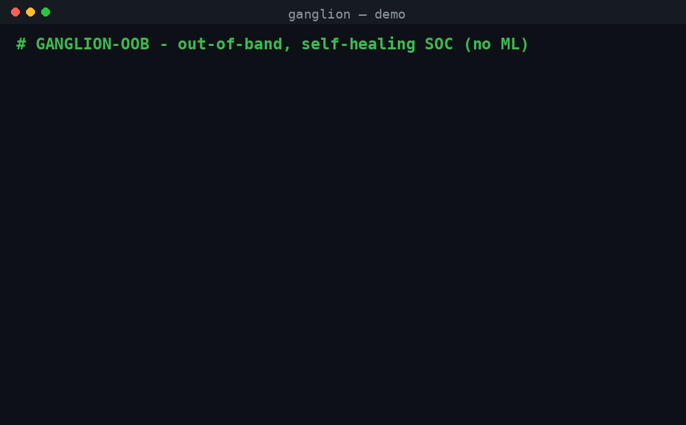

<div align="center">

<br/>

# 🛡️ GANGLION‑OOB

### Out‑of‑Band Cyber Resilience — ransomware can't kill what it can't reach.

**An automation‑first SOC + Blue‑Team platform that detects modern attacks in milliseconds, contains the infected machine at the network layer, and fails the workload over to a warm standby — so the business keeps running while humans do the decisive work.**

**Version 3.7.1** · Status: stable · Python 3.10+ · Linux / Windows / macOS

[](CHANGELOG.md)
[](https://www.python.org/)
[](common/secure_channel.py)
[](common/mitre_attack.py)
[](blue_team/sigma_engine/)
[](common/stix_export.py)
[](common/attack_navigator.py)
[](common/audit_log.py)
[%20·%20fuzzed-22c55e?style=flat-square)](common/safe_eval.py)
[](verify.py)
[](tests/)
[](attack_replay.py)
[](LICENSE)

</div>

> [!TIP]
> **Fastest way to see it live:** after cloning, run the one-click launcher — it
> installs dependencies, starts the control plane, opens the dashboard, and fires
> sample attacks so you watch detection happen in real time.
> - **Windows:** double-click `run.bat` (or `.\run.bat` in PowerShell)
> - **Linux / macOS:** `bash run.sh`

```bash
# Linux / macOS
git clone https://github.com/MANISH-524/GANGLION-OOB.git && cd GANGLION-OOB
pip install -r requirements.txt
python3 demo.py        # watch a full ransomware kill-chain get defeated end-to-end
```

```powershell
# Windows (PowerShell) — inside an activated venv, use `python`, not `py` or `python3`
git clone https://github.com/MANISH-524/GANGLION-OOB.git; cd GANGLION-OOB
python -m venv .venv; .\.venv\Scripts\Activate.ps1
pip install -r requirements.txt
python demo.py
```

> [!NOTE]
> On Windows, always use **`python`** once your venv is activated — `py` uses its own
> registry-based lookup and ignores the venv, and `python3` isn't a real Windows
> command by default. Setting an env var is `$env:VAR = "value"`, not `export VAR=value`.

---

<a id="table-of-contents"></a>
## 📑 Table of Contents

1. [See It Run](#see-it-run)
2. [Philosophy — save 90% by giving up 10%](#philosophy)
3. [Real vs Simulated (read this first — full honesty)](#real-vs-simulated)
4. [Why Out-of-Band](#why-out-of-band)
5. [Architecture — three separated trust planes](#architecture)
6. [How It Works — the full lifecycle (detect → stop → save → heal → resume)](#how-it-works)
7. [The Ransomware Kill-Chain](#kill-chain)
8. [What It Detects — 28 ATT&CK techniques](#what-it-detects)
9. [Self-Healing — the nervous-system model](#self-healing)
10. [Deterministic Decision Engine (no AI, by design)](#decision-engine)
11. [Perimeter Defense — IDS / IPS / WAF / Firewall](#perimeter-defense)
12. [Blue-Team Suite — 24 tools, one CLI](#blue-team-suite)
13. [Standards & Interop — Sigma import, ATT&CK Navigator, STIX, SBOM](#standards-interop)
14. [DFIR — tamper-evident decision audit log](#dfir-audit-log)
15. [Installation & Running (Linux, Windows, macOS)](#installation)
16. [Security Posture & Static Analysis](#security-posture)
17. [Defense Guide & FAQ — own it, don't just show it](#defense-guide)
18. [Repository Structure](#repository-structure)
19. [Roadmap](#roadmap)
20. [Design Principles](#design-principles)
21. [Versioning & Changelog](#versioning)
22. [License](#license)

---

<a id="see-it-run"></a>
## ▶️ See It Run



Above: `demo.py` running the full ransomware kill‑chain — detection → instant network block → isolation → failover to a warm standby → self‑heal — defeated end‑to‑end in ~0.8 s. Run it yourself with `python demo.py`, or use the one‑click launcher (`run.bat` / `run.sh`) to watch it live in the dashboard.

> [!IMPORTANT]
> **One command tells the whole story.** `python demo.py` runs a live kill‑chain — **crypto‑spike → instant network block → isolation → failover to a warm standby → self‑heal** — then prints the measured recovery time and the MITRE ATT&CK coverage report. No hypervisor, no cloud, no setup.

[↑ Back to top](#table-of-contents)

---

<a id="philosophy"></a>
## 🧭 Philosophy — save 90% by giving up 10%

> *"You can't save 100%. Chasing 100% is exactly how organisations lose almost everything. A 10–20% hit while the business stays online beats a 100% outage every single time."*

In cybersecurity **no code, no AI, no WAF, and no IDS/IPS replaces humans** — attacks are run by humans, and stopping them takes humans too. Ganglion‑OOB is built to **work with the team, not instead of it**: it detects, contains, buys time, and hands analysts a clean, ATT&CK‑mapped picture so they make the call. Automation does the millisecond reflexes; people do the judgement.

[↑ Back to top](#table-of-contents)

---

<a id="real-vs-simulated"></a>
## ⚖️ Real vs Simulated (read this first — full honesty)

This repo is a **working reference implementation**. Detection logic, the authenticated channel, scoring, correlation, the SOC workflow, and the blue‑team tooling are **real and runnable today**. The parts that touch physical infrastructure ship as **clearly‑labelled adapters** you point at your own environment.

| Capability | Status | Notes |
|---|---|---|
| Authenticated telemetry (AES‑256‑GCM, replay + spoof protection) | ✅ **Real** | `common/secure_channel.py`, proven by `verify.py` |
| Detection engine (Sigma + scoring + ATT&CK mapping) | ✅ **Real** | 16 rules, 28 techniques, `verify.py` + `attack_replay.py` |
| Official Sigma community-rule import | ✅ **Real** | full modifier set (`contains/startswith/endswith/re/cidr/base64/windash/lt/gt/cased/exists`), recursive loader with a compatibility report |
| ATT&CK Navigator layer export | ✅ **Real** | `common/attack_navigator.py` — coverage or live layer for the official Navigator |
| STIX 2.1 bundle export | ✅ **Real** | `common/stix_export.py` — attack-patterns + indicators + relationships for OpenCTI/MISP/Sentinel |
| CycloneDX SBOM | ✅ **Real** | `common/sbom.py` — CycloneDX 1.5 with resolved dependency versions |
| Tamper-evident decision audit log (DFIR) | ✅ **Real** | `common/audit_log.py` — hash-chained + HMAC-signed; detects edit/delete/reorder/forgery |
| Parser fuzzing | ✅ **Real** | `tests/fuzz_parsers.py` — 10k+ adversarial inputs; 0 crashes/hangs/mis-parses |
| SOC alert workflow (queue, lifecycle, MTTD/FP metrics) | ✅ **Real** | `blue_team/alert_correlator/` |
| Host network containment (iptables/nftables/netsh/pf) | ✅ **Real, dry‑run by default** | `host_control_plane/containment.py` — pass `--live` to apply |
| 24‑tool blue‑team suite | ✅ **Real** (depth varies) | some tools focused, a few marked *experimental* |
| Hypervisor isolation / snapshot rollback | ✅ **Real (KVM) + adapters** | `libvirt_backend.py` on KVM/QEMU (dry‑run default); `hypervisor_api.py` wraps VBox + Proxmox |
| Warm‑standby failover | ✅ **Real adapter available** | `libvirt_backend.py` drives real KVM/QEMU; `SimulatedBackend` for zero‑infra demos; `~0.8s` RTO is the **simulated** timeline |
| Guest emitters for every technique | 🚧 **Partial** | agent emits FS/proc/socket/crypto today; LSASS, PowerShell, driver‑load, cloud on the roadmap |

> The design deliberately separates *detection content* (real, portable, standards‑based) from *infrastructure actuators* (adapters you own).

> **The dashboard never claims a containment that didn't happen.** When you run the
> control plane on a box with no hypervisor/root backend (e.g. a laptop demo), an
> isolation decision is shown as **`QUARANTINE • UNENFORCED`** with the exact reason
> — *"detection + decision are real; the network cut requires a VM/hypervisor host."*
> It flips to a green **`ISOLATED`** only when a real containment step actually
> succeeds. The intent (detect + decide) and the enforcement (cut the network) are
> reported as two separate truths, never conflated.

[↑ Back to top](#table-of-contents)

---

<a id="why-out-of-band"></a>
## 🧠 Why Out-of-Band

Every security tool that runs **inside** the OS shares one fatal flaw: malware with admin rights can switch it off. Ransomware's playbook is exactly that — *kill the agent, delete the backups, encrypt everything.* And even when an infected box **is** isolated, the workload stops, so the business eats the full outage anyway.

<table>
<tr>
<td width="50%" valign="top">

#### ❌ Traditional in‑host EDR
- Runs **inside** the VM → killable by privileged malware
- Detects ransomware *after* encryption is underway
- Isolates the victim → **workload stops, business halts**
- Alerts in a vendor format nobody else speaks
- "Trust me, it works" — no proof

</td>
<td width="50%" valign="top">

#### ✅ Ganglion‑OOB
- Control plane runs **outside** the VM → malware can't reach it
- **Crypto‑spike detector** catches mass‑encryption as it starts
- Isolates **and fails over** → **workload keeps running**
- Every alert mapped to **MITRE ATT&CK** + **Sigma**
- **Proven** — 44 checks, 14/14 replay, measured MTTD, 0 FP

</td>
</tr>
</table>

> [!NOTE]
> To defeat Ganglion‑OOB an attacker must escape the VM all the way to the hypervisor — a far higher bar than killing an in‑OS agent. And killing the agent isn't a blind spot: silence past the heartbeat window is itself a detection (**T1562.001 – Impair Defenses**).

[↑ Back to top](#table-of-contents)

---

<a id="architecture"></a>
## 🏗️ Architecture — three separated trust planes

```
                            ┌───────────────────────────────────────────────┐
   GUEST VM (untrusted)     │             HOST CONTROL PLANE                 │
 ┌──────────────────────┐   │  ┌─────────────────────────────────────────┐  │
 │  Sentry Agent         │──┼─▶│  SecureReceiver → Correlation / Scoring   │  │
 │  (sender-only,        │AES│  │  Sigma engine · ATT&CK map · SOC queue    │  │
 │   zero listen ports)  │GCM│  └───────────────────┬─────────────────────┘  │
 └──────────────────────┘   │                       │ threat score ≥ threshold │
   authenticated,           │                       ▼                          │
   replay-protected         │  ┌─────────────────────────────────────────┐    │
                            │  │  RESPONSE                                 │    │
                            │  │  • host containment (iptables/nftables/   │    │
                            │  │    netsh/pf)  ← real, dry-run by default   │    │
                            │  │  • hypervisor isolate/dump/rollback        │    │
                            │  │    (VBox/Proxmox/KVM adapter)              │    │
                            │  │  • warm-standby failover (RTO timeline)    │    │
                            │  └─────────────────────────────────────────┘    │
                            └───────────────────────────────────────────────┘
                                            │
                ┌───────────────────────────┴───────────────────────────┐
                ▼                                                         ▼
        WARM STANDBY (promoted → ACTIVE)                   INFECTED VM (cured → rejoins as standby)
```

- **Guest VM** runs `guest_production_vm/sentry_agent.py` — a *sender‑only* telemetry daemon with **zero listening ports**. It watches files, processes, and sockets and streams authenticated events out.
- **Host Control Plane** runs `host_control_plane/control_center.py` — receives authenticated telemetry, scores threats **server‑side (agent‑claimed scores are never trusted)**, matches Sigma rules, drives the SOC queue, and triggers response.
- **Response actuators** — network containment (real), hypervisor IR (adapter), failover (simulated backend + real orchestration logic).

[↑ Back to top](#table-of-contents)

---

<a id="how-it-works"></a>
## ⚙️ How It Works — the full lifecycle

This traces one incident end-to-end through the **actual code paths** — how the system **detects → stops → saves → backs up → heals → resumes at the same strength**.

### The one-sentence model

> A sender-only sensor inside the workload streams **authenticated** telemetry to an **out-of-band** brain the malware can't reach; the brain **scores** the threat itself, fires an **instant reflex** to cut the danger, runs **incident response + backup**, **fails the workload over** to a warm standby so the business never stops, then **heals** the infected node and returns it to duty at full strength.

### The pipeline at a glance

```
 SENSE ─▶ AUTHENTICATE ─▶ SCORE ─▶ REFLEX(stop) ─▶ IR+BACKUP(save) ─▶ FAILOVER(keep running)
   │           │            │          │                │                     │
 sentry    secure_       control_   reflex_arc /     hypervisor_api      failover_
 _agent    channel       center     instant_block    (isolate/dump/      orchestrator
 ids/waf   (AES-GCM)     (server-    + containment    restore)            (promote standby)
                          side)       .py                                        │
                                                                                 ▼
                                                              HEAL ─▶ REJOIN(same strength)
                                                       healing_orchestrator / restore_snapshot
```

### 1 · DETECT — how it senses

| Sensor | File | Watches for |
|---|---|---|
| Guest agent | `guest_production_vm/sentry_agent.py` | file entropy/velocity (ransomware), suspicious process exec, shadow-copy deletion, unexpected sockets |
| Network IDS/IPS | `blue_team/ids_engine/ids_engine.py` | known-bad IPs, C2 ports, port scans, host sweeps, brute force, low-jitter beacons |
| Web WAF | `blue_team/waf_engine/waf_engine.py` | SQLi, XSS, path traversal, RCE, SSRF, JNDI/Log4Shell, scanners |

The guest agent is **sender-only with zero listening ports** — it can talk out but nothing can talk in. Every event is mapped to **MITRE ATT&CK** and matched against **Sigma rules**: two independent opinions (behavioral score + signature rule) must line up before a high-confidence verdict.

### 2 · AUTHENTICATE — why the telemetry can't be forged

Telemetry travels over `common/secure_channel.py`: **AES-256-GCM** authenticated encryption (a forged/tampered frame fails the tag and is dropped), **per-agent HKDF keys** (one compromised key can't impersonate another), a **replay window + monotonic sequence** (a captured frame replayed later is rejected), and **identity binding** (the frame's claimed source must match its key). `verify.py` tests tamper, replay, and spoof.

### 3 · SCORE — the brain decides, not the agent

`_resolve_delta(event_type, details)` assigns the **authoritative** score for each event — **the agent's own claimed score is never trusted.** Scores accumulate per-VM in a rolling window, so a slow multi-step attack still crosses the threshold as evidence stacks. `INSTANT_BLOCK_TYPES` (mass encryption, LSASS dump, ESXi encryption) skip the queue; `ISOLATION_THRESHOLD` triggers full response.

### 4 · STOP — the reflex (millisecond containment)

1. **Spinal reflex** (`self_healing/reflex_arc.py`): a high-confidence signal becomes an isolate command with no wait for full correlation — like pulling your hand off a hot stove.
2. **Instant block** (`control_center._instant_block`): fires **hypervisor NIC block** + **host network containment** (iptables/nftables/netsh/pf) in parallel, keeping a management CIDR reachable so responders aren't locked out, fully reversible via `lift()`.

### 5 · SAVE + BACKUP — preserve evidence and a clean image

`hypervisor_api.full_incident_response(vm_id)` runs the out-of-band IR sequence: **isolate** (quarantine VLAN) → **dump memory** (RAM → `forensics_archive/` before it's lost) → **restore snapshot** (roll the infected disk back to a clean golden image). Because this runs at the hypervisor layer, **malware inside the VM cannot stop the dump or the rollback.**

### 6 · KEEP RUNNING — failover so the business never stops

`failover_orchestrator.handle_compromise(vm_id)` **promotes a warm standby to ACTIVE** and redirects the service VIP. The workload keeps serving while the infected node is cured. The pluggable `FailoverBackend` interface wires to real infra (Keepalived/HAProxy, cloud LB); the shipped `SimulatedBackend` models realistic latency (the `~0.8s` RTO is the **simulated** timeline).

### 7 · HEAL — recover to the same strength

`self_healing/healing_orchestrator.reconcile()` runs a homeostatic control loop: **desired-state reconciliation** (idempotent corrective actions), **circuit breaker** (OPEN → HALF-OPEN → CLOSED to stop healing storms), **remediation playbooks** (symptom → cure with exponential backoff + jitter), and **human escalation** at the attempt cap instead of thrashing. The cured node **rejoins as the new standby** — the pair is whole again at full strength. Roles are symmetric: whoever was standby is now active, whoever was infected is now the clean standby.

### The vision — a resilience *substrate*

The goal isn't "another EDR." It's a **foundation layer workloads run on and depend on for survival**. A workload (including an AI service) sits *inside* the protected VM; Ganglion is the out-of-band nervous system that keeps it alive. The design is deliberately friendly to a **hardware/firmware split** (control plane on a separate SoC / SmartNIC / BMC, identity keys in a TPM, containment in the NIC/switch) so the trust root can be immutable while detection content stays updatable — *standards for detection, hardware for the trust boundary.*

[↑ Back to top](#table-of-contents)

---

<a id="kill-chain"></a>
## 🦠 The Ransomware Kill-Chain (what `demo.py` shows)

```
┌─────────────────────────────────────────────────────────────┐
│ 1. BLOCK     host NIC drop in milliseconds (cut C2/exfil)    │
│ 2. ISOLATE   move VM to quarantine VLAN (hypervisor adapter) │
│ 3. DUMP      capture RAM → forensics_archive/                │
│ 4. FAILOVER  promote warm STANDBY → ACTIVE, redirect VIP     │
│              ►►►  WORKLOAD KEEPS RUNNING  (RTO ~0.8s sim)    │
│ 5. RESTORE   rollback infected disk to a clean golden image  │
│ 6. REJOIN    cured VM returns as the new STANDBY (self-heal) │
└─────────────────────────────────────────────────────────────┘
```

[↑ Back to top](#table-of-contents)

---

<a id="what-it-detects"></a>
## 🎯 What It Detects (28 ATT&CK techniques · 16 Sigma rules)

> [!NOTE]
> **On the detection layer, honestly:** some Sigma rules are full field‑level signatures (encoded‑PowerShell, LOLBins, WAF classes), while others are **event‑type routing rules** — the heavy classification happens once in the sentry agent, and the rule maps that labelled event to an ATT&CK technique. Both are useful, but "16 rules" is not 16 independent field‑level detections. With the official-modifier Sigma engine you can now also import the full community rule corpus for field-level depth (see [Standards & Interop](#standards-interop)).

| ATT&CK | Technique | Tactic | Ganglion signal |
|---|---|---|---|
| T1486 | Data Encrypted for Impact | Impact | crypto‑spike ≥3σ over baseline |
| T1486 | ESXi/hypervisor datastore encryption | Impact | mass `.vmdk/.vmx` write |
| T1490 | Inhibit System Recovery | Impact | `vssadmin`/backup destruction |
| T1496 | Resource Hijacking | Impact | abnormal crypto/CPU |
| T1003.001 | LSASS Credential Dumping | Credential Access | LSASS memory access |
| T1558.003 | Kerberoasting | Credential Access | SPN TGS request burst |
| T1621 | MFA Fatigue / Push Bombing | Credential Access | repeated push approvals |
| T1110 | Brute Force | Credential Access | auth failure spray |
| T1059.001 | Encoded / Obfuscated PowerShell | Execution | `-enc`, download‑cradle |
| T1027 | Obfuscated Files or Information | Defense Evasion | base64/compressed payload |
| T1059 | Command & Scripting Interpreter | Execution | shell spawn |
| T1218 | LOLBin Proxy Execution | Defense Evasion | rundll32/mshta/regsvr32 |
| T1562.001 | Impair Defenses / agent kill | Defense Evasion | heartbeat silence |
| T1036.005 | Masquerading exec path | Defense Evasion | exec from `/tmp`, temp |
| T1068 | BYOVD kernel driver load | Privilege Escalation | known‑vulnerable driver |
| T1505.003 | Web Shell | Persistence | web server spawns shell |
| T1053 | Scheduled Task/Job | Persistence | cron/schtasks add |
| T1546.003 | WMI Event Subscription | Persistence | fileless WMI consumer |
| T1136 | Create Account | Persistence | new privileged account |
| T1219 | Remote Access Software (RMM) | C2 | AnyDesk/ScreenConnect/etc. |
| T1071 / T1571 | C2 app‑layer / non‑standard port | C2 | unexpected outbound |
| T1560 | Archive Collected Data | Collection | rar/7z staging |
| T1567.002 | Exfil to Cloud Storage | Exfiltration | rclone/MEGA/S3 bulk out |
| T1078.004 | Valid Cloud Accounts | Defense Evasion | impossible travel / anomalous logon |
| T1021 | Remote Services (lateral) | Lateral Movement | RDP/SSH/SMB spread |

[↑ Back to top](#table-of-contents)

---

<a id="self-healing"></a>
## 🧠 Self-Healing — the nervous-system model

Ganglion models its detect → respond → recover loop on the **human nervous system**, because biology already solves resilience: sense damage, react at the reflex level *before* the brain, escalate to the brain for judgement, and continuously restore toward a healthy baseline (homeostasis).

### Biology → Ganglion mapping

| Biological structure | Function | Ganglion component |
|---|---|---|
| Sensory receptors | sense damage/stimuli | `sentry_agent`, `ids_engine`, `waf_engine`, blue-team tools |
| Afferent nerves | carry signals inward | `common/secure_channel.py` (authenticated telemetry) |
| **Spinal reflex arc** | instant local response, no brain wait | `self_healing/reflex_arc.py` |
| Brain / CNS | deliberate correlation + decision | `control_center.py` + `self_healing/nervous_system.py` |
| Efferent nerves | carry commands outward | `EfferentCommand` on the bus |
| Effectors (muscles) | perform the action | `containment.py`, `firewall`, `failover_orchestrator.py`, healing |
| **Homeostasis** | keep vitals in a healthy range | `self_healing/health_monitor.py` |
| **Healing / regeneration** | repair damage | `self_healing/healing_orchestrator.py` |

### One typed signal bus

Every module talks through **one auditable publish/subscribe bus** (`NervousSystem`) using three typed signals — `AfferentSignal` (something was sensed), `ReflexSignal` (a fast local decision fired), `EfferentCommand` (a deliberate command to an effector) — instead of ad-hoc calls. That single design choice makes the whole system observable and testable.

### The two response paths

**Reflex arc — millisecond protection** (`reflex_arc.py`): a tiny set of unambiguous, high-confidence signals bypass full correlation and trigger protection immediately. Reflexes never fire on low-confidence signals.

| Trigger | Reflex action | Why it's reflex-worthy |
|---|---|---|
| `crypto_spike` (T1486) | isolate host | mass encryption leaves no doubt |
| `cred_dump` (T1003.001) | isolate host | LSASS theft precedes ransomware |
| `ransomware_esxi` (T1486) | isolate host | one host encrypts many VMs |
| `agent_silence` (T1562.001) | probe + restart sensor | a blind sensor must be healed fast |

**CNS — deliberate judgement**: lower-confidence signals accumulate a server-side score; crossing the isolation threshold runs full IR + failover. This is the slow, correct path where a human analyst stays in the loop.

### Self-healing algorithms (homeostasis + repair)

1. **Desired-state reconciliation** — compare each component's actual health to its desired state; emit the corrective action. Idempotent, safe every tick.
2. **Circuit breaker** — a component that keeps failing is tripped OPEN so failures stop cascading; after a cool-down it goes HALF-OPEN to probe, then CLOSED once healthy.
3. **Remediation playbooks** — `symptom → ordered cure steps` with exponential backoff + jitter and a hard attempt cap that **escalates to a human** rather than looping forever.
4. **Graceful degradation** — HEALTHY → DEGRADED → UNHEALTHY → DEAD, so a component can keep serving degraded instead of dying outright.

| State | Meaning | Typical trigger |
|---|---|---|
| HEALTHY | vitals in range, heartbeats on time | normal |
| DEGRADED | a vital out of range or 1 missed beat | overload |
| UNHEALTHY | multiple missed heartbeats | stall / partial failure |
| DEAD | prolonged silence | crash / tamper |

```bash
PYTHONPATH=. python3 -m self_healing.runtime            # full loop, dry-run safe
PYTHONPATH=. python3 -m self_healing.reflex_arc
PYTHONPATH=. python3 -m self_healing.healing_orchestrator
```

[↑ Back to top](#table-of-contents)

---

<a id="decision-engine"></a>
## 🧭 Deterministic Decision Engine (no AI, by design)

Everyone's bolting an LLM onto the SOC. Ganglion does the opposite: a **transparent, rule‑based decision engine** (`decision_engine/`) chooses the response — MONITOR / ALERT / CONTAIN / FAILOVER / HEAL / ESCALATE — and **explains every decision** by listing the exact rules that fired and their weights. No model, no training data, no probabilistic drift.

- **Hard safety gates** first (e.g. mass‑encryption ⇒ CONTAIN, always — cannot be outvoted).
- **Weighted rules** accumulate toward each candidate action; highest total wins (a scorecard, not a neural net).
- **Escalates to a human** when the margin is thin or the situation is irreversible/novel.

```bash
PYTHONPATH=. python3 decision_engine/decision_engine.py   # see it reason, with explanations
```

**Wired into the live control plane:** every processed event produces a stored, explainable decision (verdict + fired rules + weights), surfaced in each VM's status for the dashboard — so operators see *why* an action was taken. In security, **explainability is a feature**: a deterministic decision you can read, test, and defend line‑by‑line beats a black‑box answer you can only trust.

[↑ Back to top](#table-of-contents)

---

<a id="perimeter-defense"></a>
## 🧱 Perimeter Defense — IDS / IPS / WAF / Firewall (built‑in)

Configuration‑driven engines that plug into the same scoring + ATT&CK + response pipeline. The detection logic and enforcement wiring are Ganglion's own.

| Engine | Detects | ATT&CK | Enforcement |
|---|---|---|---|
| **WAF** (`waf_engine`) | SQLi, XSS, path traversal, RCE, SSRF, JNDI/Log4Shell, scanners | T1190 / T1595 | BLOCK verdict (additive anomaly score) |
| **IDS/IPS** (`ids_engine`) | known‑bad IPs, C2 ports, port scan, host sweep, brute force, low‑jitter beacon | T1046 / T1071 / T1571 / T1110 | inline ALLOW/DROP/RESET |
| **Firewall** (`firewall`) | first‑match‑wins, default‑deny policy | — | compiles to real OS backends (iptables/nftables/netsh/pf), dry‑run default |

```bash
python3 blue_team/ganglion.py run waf_engine --test
python3 blue_team/ganglion.py run ids_engine --test
python3 blue_team/ganglion.py run firewall  --test
```

[↑ Back to top](#table-of-contents)

---

<a id="blue-team-suite"></a>
## 🧰 Blue-Team Suite — 24 tools, one CLI

A from-scratch Blue Team / SOC platform: **24 original tools, 13,000+ lines, zero external detection-engine dependencies.** Every detection engine, scoring model, and dashboard was built specifically for this project — nothing here wraps an existing open-source scanner. Run any tool via `python3 blue_team/ganglion.py <tool>`.

### Why this is different from a typical toolkit

| Typical approach | Ganglion-OOB approach |
|---|---|
| Wraps `nmap`/`masscan` | Pure-Python concurrent TCP/UDP scanner with its own CVE-surface mapper |
| Wraps `libyara` | Original `.vyr` rule engine + parser in Python, zero C deps |
| Simple regex log grep | Statistical anomaly models (Z-score, circular time-of-day, robust MAD) |
| Single-tool alerting | Cross-tool **Alert Correlator** with entity resolution + kill-chain reconstruction |
| Static DGA list | Local n-gram language model trained on a built-in corpus — no API calls |
| Basic honeypot | 6 protocol-specific honeypots with attacker-intent classification |
| One-off scripts | Unified `ganglion` CLI + Master SOC Dashboard tying all tools together |

### The tools

| Tool | Category | What it does |
|------|----------|---------------|
| `threat_intel` | Intel | IOC feed engine, Bloom-filter lookup, reputation scoring, REST API |
| `log_analyzer` | Detection | Multi-format log parser (syslog/nginx/apache/json/windows) + 25 detection rules |
| `vuln_scanner` | Scanning | Concurrent port scanner, service fingerprinting, CVE-surface mapping, TLS audit |
| `packet_inspector` | Network | Pure-Python PCAP decoder, DNS/HTTP/TLS-SNI parsing, beacon/port-scan/tunnel detection |
| `ioc_hunter` | Hunting | Filesystem + process memory + persistence-location IOC hunter |
| `yara_engine` | Detection | Original `.vyr` rule language + parser + matcher (no libyara) |
| `timeline_builder` | Forensics | Multi-source forensic timeline (FS, logs, processes, network, tool JSON) |
| `network_mapper` | Network | ARP/ICMP/TCP LAN discovery, OUI vendor lookup, OS fingerprinting, rogue detection |
| `file_integrity` | Integrity | Dual-hash (SHA256+BLAKE2b) FIM with HMAC-chained tamper-evident baselines |
| `lateral_movement_detector` | Detection | Auth-graph analysis: fan-out, fan-in, chain-hop, Kerberoasting, AS-REP roasting |
| `dns_analyzer` | Network | DGA (n-gram model), fast-flux, DNS tunneling, typosquat/homoglyph detection |
| `credential_monitor` | Identity | Password-spray detection, entropy-gated secret scanner, hash-strength auditor |
| `alert_correlator` | Correlation | **The integration spine** — unifies all schemas, dedups, reconstructs kill chains |
| `behavioral_engine` | UEBA | 4 baseline models: circular time, peer-rarity, robust MAD, Markov chains |
| `config_auditor` | Hardening | 33+ CIS-inspired checks across SSH/PAM/kernel/filesystem/services/audit/cron |
| `deception_engine` | Deception | Canary files/credentials/DNS/processes with access + exfil-staging detection |
| `threat_hunter` | Hunting | 9 hypothesis-driven hunt playbooks (CONFIRMED/SUSPECT/NEGATIVE verdicts) |
| `reporting_engine` | Reporting | Executive/Technical/Compliance/Delta reports with inline SVG charts |
| `honeypot_manager` | Deception | 6 protocol honeypots (SSH/HTTP/FTP/MySQL/Telnet/raw) + intent classifier |
| `memory_forensics` | Forensics | Live `/proc` memory scanning + offline ELF core-dump analysis, zero Volatility dep |
| `soc_dashboard` | Dashboard | Real-time Flask dashboard unifying all detection tools |
| `waf_engine` | Perimeter | Web app firewall (SQLi/XSS/RCE/SSRF/JNDI) |
| `ids_engine` | Perimeter | Network IDS/IPS (scan/beacon/brute/known-bad) |
| `firewall` | Perimeter | Config-driven policy → OS enforcement |

### Quick start

```bash
cd blue_team
pip install -r requirements.txt

python3 ganglion.py tools                                   # list everything
python3 ganglion.py run vuln_scanner --target 192.168.1.1   # run one tool
python3 ganglion.py audit --path /etc                       # hardening + IOC + integrity
python3 ganglion.py hunt                                    # 9 proactive hunt playbooks
python3 ganglion.py sweep 192.168.1.0/24                    # network discovery + vuln scan
python3 ganglion.py correlate findings/                     # unify every tool's findings
python3 ganglion.py report findings/                        # executive + technical reports
python3 ganglion.py dashboard --port 8080                   # live Master SOC Dashboard
python3 ganglion.py full-scan --target-dir /etc --network-target 192.168.1.0/24
```

### How the pieces connect

```
  24 detection tools  (each writes JSON findings)
        ▼
  findings/*.json
        ▼
  alert_correlator.py  ──►  unified schema, dedup, kill-chain reconstruction
        │
        ├──►  soc_dashboard.py     (live visual ops view)
        ├──►  reporting_engine.py  (executive/technical/compliance reports)
        └──►  control_center.py    (Ganglion-OOB OOB isolation trigger)
```

The correlator auto-detects each tool's schema (no manual config), converts it into a unified `UnifiedFinding`, then **deduplicates** repeat alerts (content-hash + time-bucket), **resolves entities** (all findings about one host/IP/user converge), and **reconstructs campaigns** (ATT&CK tactic-ordered chains spanning ≥3 tactics get a multiplied risk score, surfacing real attacks above noise).

### False-positive engineering

Every detector was explicitly designed to minimize false positives, not just maximize detection:

- **DGA detection** uses a trained linguistic plausibility model, not a flat entropy threshold — `cloudflare.com` scores high while `qhxzkptbvmlfjg.biz` scores near zero.
- **UEBA time-of-day model** uses circular statistics so a night-shift worker's normal hours never false-positive on wraparound.
- **UEBA process model** uses peer-rarity — a tool used by 1/3 of your fleet is normal even if new to one user; a tool used by 0/50 is flagged.
- **Password-spray detector** requires BOTH high account fan-out AND abnormally regular timing OR overwhelming volume — a user mistyping 3 times never triggers it.
- **Secret scanner** entropy-gates generic patterns so UUIDs, version strings, and `"changeme"` placeholders are never flagged.
- **Config auditor** uses PASS/FAIL/WARN/**SKIP** — a missing subsystem (e.g. no auditd on a minimal container) is SKIP, not FAIL.

### Architecture notes

- **Zero required external detection dependencies** — only `psutil`, `flask`, and `requests` are needed (no nmap, libyara, Volatility, Suricata).
- **Every tool runs standalone** and **also speaks the unified finding schema** when run with `--json`/`--output`, so they compose automatically through the correlator.
- **Pure stdlib + small surface** — easy to audit, easy to extend, easy to fork.

[↑ Back to top](#table-of-contents)

---

<a id="standards-interop"></a>
## 🔗 Standards & Interop — Sigma import, ATT&CK Navigator, STIX, SBOM

Ganglion **speaks the formats the ecosystem uses** — standards in for detection, standards out for interchange — while keeping the correlation/scoring/decision logic proprietary. Nothing here needs a live third-party service; every export is deterministic JSON.

### Official Sigma community-rule import (in)

The Sigma engine supports the full official modifier set — `contains / startswith / endswith / re / cidr / base64 / base64offset / windash / cased / exists`, numeric `lt / lte / gt / gte`, and compound forms like `contains|all`. Point it at a clone of the SigmaHQ repo and drop the community corpus in unchanged:

```python
from blue_team.sigma_engine.sigma_engine import SigmaEngine
eng = SigmaEngine()
report = eng.load_community_rules("/path/to/sigma")   # recursive load + compatibility report
```

### ATT&CK Navigator layer export (out)

Emit a valid Navigator layer (coverage or live-scored) that loads directly at the official [ATT&CK Navigator](https://mitre-attack.github.io/attack-navigator/):

```bash
ganglion attack-layer                       # writes ganglion_attack_layer.json
# or via the control plane:  GET /api/attack-layer?mode=coverage|live
```

### STIX 2.1 bundle export (out)

Emit a standards-compliant STIX 2.1 bundle (attack-patterns + indicators + relationships, deterministic UUIDv5 ids, MITRE external references) for import into **OpenCTI, MISP, Microsoft Sentinel, or TheHive**:

```bash
ganglion stix-export                        # writes ganglion_detections.stix.json
# or via the control plane:  GET /api/stix?mode=coverage|live
```

### CycloneDX SBOM (supply chain)

Generate a CycloneDX 1.5 software bill of materials with resolved dependency versions and PURLs:

```bash
ganglion sbom                               # writes ganglion.sbom.cdx.json
```

### Parser fuzzing (quality)

The hand-written `safe_eval` and Sigma condition parsers are fuzzed with 10k+ random/adversarial inputs and must only ever return a bool or reject cleanly — never crash, hang, or mis-parse:

```bash
python3 -m tests.fuzz_parsers --iterations 10000     # 0 findings across seeds
```

[↑ Back to top](#table-of-contents)

---

<a id="dfir-audit-log"></a>
## 🔐 DFIR — Tamper-Evident Decision Audit Log

Every decision the control plane makes (verdict + inputs + explanation) is written to an **append-only, hash-chained, HMAC-signed** JSONL log. Any edit, deletion, reorder, or forgery is detectable — the property you need for a court-defensible incident trail.

```bash
ganglion audit-verify                       # verify the chain + signatures
python3 -m common.audit_log --verify        # same, standalone
# or via the control plane:  GET /api/audit
```

- Set `GANGLION_AUDIT_KEY` (hex) to enable HMAC signatures on every entry.
- The log path is anchored to the repo and always absolute (honors `GANGLION_AUDIT_PATH`), so it never depends on where you launch the process from.
- On a corrupt tail the log **hard-fails** with `AuditIntegrityError` rather than silently continuing (override for recovery with `GANGLION_AUDIT_ALLOW_RESET=1`).

[↑ Back to top](#table-of-contents)

---

<a id="installation"></a>
## ⚙️ Installation & Running (Linux, Windows, macOS)

**Requirements:** Python 3.10+ and pip. Everything runs in dry‑run/simulated mode with no special privileges — perfect for demos, labs, and CI.

### Linux / macOS
```bash
git clone https://github.com/MANISH-524/GANGLION-OOB.git && cd GANGLION-OOB
python3 -m venv .venv && source .venv/bin/activate
pip install -r requirements.txt

python3 demo.py            # full attack→defense story
python3 verify.py          # 44 correctness checks
python3 attack_replay.py   # ATT&CK coverage + MTTD + FP-rate
pytest -q                  # unit tests
```
Optional real network containment (needs root; **preview the commands first**):
```bash
python3 host_control_plane/containment.py                 # dry-run, prints exact rules
sudo python3 host_control_plane/containment.py --live --mgmt-allow 10.0.0.0/24
sudo python3 host_control_plane/containment.py --lift     # remove the rules
```
Convenience installer + systemd units:
```bash
./install_linux_mac.sh
# services: guest_production_vm/ganglion-sentry.service, host_control_plane/ganglion-control.service
```

### Windows (PowerShell)
```powershell
git clone https://github.com/MANISH-524/GANGLION-OOB.git; cd GANGLION-OOB
python -m venv .venv; .\.venv\Scripts\Activate.ps1
pip install -r requirements.txt

python demo.py
python verify.py
python attack_replay.py
pytest -q
```
> Once `.venv` is activated, always call **`python`** — not `py` (its registry-based lookup ignores the venv) and not `python3` (not a real command on Windows by default).

Real containment on Windows uses `netsh advfirewall` (Run as Administrator, preview first):
```powershell
python host_control_plane\containment.py --force netsh            # dry-run
python host_control_plane\containment.py --force netsh --live     # applies block rules
```
Or use `install_windows.bat`.

### Production hardening (before any real deployment)
```bash
# Linux / macOS
export GANGLION_MASTER_KEY=$(python3 -c "import os;print(os.urandom(32).hex())")   # never ship the dev key
export GANGLION_API_TOKEN=$(python3 -c "import secrets;print(secrets.token_urlsafe(24))")
export GANGLION_AUDIT_KEY=$(python3 -c "import os;print(os.urandom(32).hex())")     # sign the decision log
python3 host_control_plane/control_center.py --api-token "$GANGLION_API_TOKEN" --allow-ips 10.0.0.0/24
```
```powershell
# Windows (PowerShell) - note $env: syntax, not export
$env:GANGLION_MASTER_KEY = (python -c "import os;print(os.urandom(32).hex())")
$env:GANGLION_API_TOKEN  = (python -c "import secrets;print(secrets.token_urlsafe(24))")
$env:GANGLION_AUDIT_KEY  = (python -c "import os;print(os.urandom(32).hex())")
python host_control_plane\control_center.py --api-token $env:GANGLION_API_TOKEN --allow-ips 10.0.0.0/24
```

[↑ Back to top](#table-of-contents)

---

<a id="security-posture"></a>
## 🔒 Security Posture & Static Analysis

Ganglion-OOB is defensive security software and is held to a defensive-software bar:

- **No `eval` / `exec` on rule content.** Sigma and YARA conditions are evaluated by a hand-written, no-eval parser (`common/safe_eval.py`) that only accepts a boolean/numeric grammar — arbitrary identifiers, attribute access, calls, and indexing are rejected. This closes the classic `eval` sandbox-escape path, and the parser is [fuzzed](#standards-interop) with 10k+ adversarial inputs.
- **Dry-run by default** for everything with real blast radius (host containment, libvirt actions). Nothing mutates a firewall or hypervisor without an explicit `--live` flag, and every action records a reversible inverse.
- **Least privilege in transport.** AES-256-GCM authenticated telemetry, per-agent HKDF keys, replay/nonce protection, identity binding, constant-time comparisons.
- **Server-side authority.** Threat scores are computed by the control plane; an agent's self-reported score is never trusted.
- **Fail loud on weak config.** The control plane warns prominently if the public dev master key or no API token is in use.
- **Tamper-evident decisions.** Every verdict is written to a hash-chained, HMAC-signed audit log (see [DFIR](#dfir-audit-log)).

### Static analysis (Bandit)

```bash
pip install bandit
bandit -r common host_control_plane guest_production_vm blue_team self_healing decision_engine -ll
bandit -r . -ll -b .bandit-baseline.json     # show only NEW findings vs the reviewed baseline
```

A reviewed baseline (`.bandit-baseline.json`) records findings that are **not** vulnerabilities — e.g. IDS/IOC detection *signatures* that contain strings like `/tmp/` (the tool hunts for malware running from `/tmp`; it does not write there), `config_auditor` reading `/tmp`'s sticky bit (an intended audit target), and `0.0.0.0/0` CIDR *match strings* in the firewall policy (not socket binds). Hashes used for fingerprinting pass `usedforsecurity=False`. Server binds default to `127.0.0.1`.

### What is NOT hardened (be honest)

- The dashboard's `/api/status` is intentionally unauthenticated so the UI can load; do not expose the control-plane port outside a management network. (State-changing actions require a token from non-localhost.)
- `FilesystemMonitor` uses polling (`rglob`) — fine for lab scale, not for millions of files. Use an event-driven watcher (inotify/ETW/FSEvents) for production.

### Reporting a vulnerability

Open a private security advisory on the GitHub repository, or email the maintainer. Please do not open a public issue for a suspected vulnerability.

[↑ Back to top](#table-of-contents)

---

<a id="defense-guide"></a>
## 🎓 Defense Guide & FAQ — own it, don't just show it

This section exists so you can **defend every part of this project under questioning**. Read a part, close it, and explain that module out loud. If you stumble, re-read.

### The one-sentence pitch (memorise this)

> "Ganglion-OOB is an out-of-band security control plane: the detection and response logic runs **outside** the monitored VM, so malware inside the VM can't disable it — and when ransomware hits, it fails the workload over to a warm standby so the business keeps running while the infected machine is cured."

### Module-by-module — what it does and WHY

**`common/secure_channel.py` — authenticated telemetry.** Seals telemetry with AES-256-GCM, per-agent HKDF keys, replay protection, identity binding.
- *AEAD (GCM):* confidentiality **and** integrity in one operation — flip a byte and decryption fails, so you can't tamper undetected.
- *Per-agent keys (HKDF):* one master secret → a unique key per agent; if one leaks, the fleet is unaffected (RFC 5869).
- *Replay protection:* a captured frame can't be re-sent to force a false isolation.
- *Identity binding:* the frame's `vm_id` is forced to equal the authenticated sender — this kills the attack where malware in VM-A sends events labelled "VM-B" to get an innocent machine isolated.

**`guest_production_vm/sentry_agent.py` — the sensor.** Scans filesystem entropy, a rolling crypto map, process lineage, backup-destruction commands, sockets.
- *Shannon entropy for ransomware:* encrypted/compressed data is high-entropy (~8 bits/byte); normal text is ~4–5; a run of files crossing ~7.2 is the signature of mass encryption.
- *Variance-aware, not a flat threshold:* it compares the recent high-entropy write rate to the host's own baseline and fires only at ≥3σ — so a server that legitimately writes encrypted blobs sits in its baseline and never trips.

**`host_control_plane/control_center.py` — the brain.** Authenticated receiver → correlation/scoring → response.
- *Additive scoring over a 60-second rolling window:* no single event isolates a machine; multiple corroborating signals must stack. A window models "how bad is it *right now*."
- *The controller computes scores itself and never trusts the agent's number:* the agent runs inside the possibly-compromised VM; the authoritative table lives on the trusted side.

**`host_control_plane/failover_orchestrator.py` — business continuity.** Models each service as an HA pair (ACTIVE + STANDBY); on compromise it promotes the standby, redirects the VIP, cures the primary, and rejoins it as the new standby. *This is the whole point:* isolation alone stops the bleeding but also stops the business. RTO is the measured seconds from "active down" to "serving on standby" — ~0.8s in the demo.

**`common/mitre_attack.py` — the vocabulary.** Maps every event to real ATT&CK IDs, because analysts think in ATT&CK; speaking it makes alerts intelligible and the tool interoperable.

**`blue_team/sigma_engine/` — industry-standard rules.** Loads Sigma YAML (the open SIEM rule standard) and matches it against telemetry; hard-coded Python detections don't scale or share, Sigma does.

**`attack_replay.py` — proof.** Fires every technique and reports ATT&CK coverage, MTTD, and FP rate. *Your strongest material:* it once found a real bug — the agent-silence technique (T1562.001) was detected but scored 0, so killing the agent didn't raise the threat score. The harness caught it; it was fixed. That's exactly how a security engineer thinks — build the thing that proves your own detections work, and trust the result over your assumptions.

### The questions you WILL be asked (with answers)

**Q: Isn't running an agent inside the VM the same problem as EDR — malware can kill it?**
A: It can, and we plan for that. The agent emits heartbeats with a monotonic sequence; silence past 3× the interval raises an `agent_silence` alert (T1562.001) and adds to the score. Killing the agent is itself a detection, not a blind spot. The *response* runs out-of-band at the hypervisor, where the agent's death doesn't matter.

**Q: How do you avoid false positives on a server that legitimately encrypts data?**
A: The crypto-spike detector is variance-based, not a fixed threshold — it learns the host's own baseline high-entropy write rate and fires only at ≥3σ. A steady encrypted workload sits in its baseline; a ransomware burst is many sigma out.

**Q: What's your MTTD/MTTR?**
A: MTTD ~110ms in the live replay (telemetry arrival to score flag). MTTR/RTO for full isolation+failover is sub-second in the demo, measured and shown on the dashboard — both produced by the harness, not estimated.

**Q: Why isolate before curing instead of just restoring?**
A: Containment first. An infected box on the network keeps spreading. You cut it off (NIC kill-switch in milliseconds on a crypto-spike), *then* fail the workload over so the business continues, *then* cure the box at leisure. Stop the bleeding, preserve continuity, recover.

**Q: What are the limits / what would you do with more time?**
A: The failover backend ships with a real KVM/libvirt adapter and a simulated one for zero-infra demos; wiring to a load balancer is the `FailoverBackend` interface. Geo-IP is an offline approximation. The detection set is the slice we can honestly claim, not the full ATT&CK matrix. I'd prioritise real GeoIP, persistent baselines, and tuning thresholds against real traffic.

### Things NOT to say (they backfire)

- ❌ "It blocks 100% of attacks / it's unbeatable." → Nothing blocks 100%. Say "reduces blast radius and preserves continuity."
- ❌ "It uses AI." → It doesn't. There's no ML here, by design — the determinism is the point.
- ❌ Overstating the geo map's accuracy. → Call it an offline approximation.

Confidence comes from knowing the limits, not hiding them.

### Your 5-step study plan

1. Run `python3 verify.py` and read each check — that's the feature list.
2. Read `secure_channel.py` top to bottom. Re-implement `_hkdf` from memory.
3. Trace one event: `sentry_agent` → `control_center.process_batch` → `alert_manager.raise_alert`. Narrate it out loud.
4. Run `python3 attack_replay.py --offline` and explain each technique + its ID.
5. Run `python3 demo.py` and narrate the failover story as if presenting it.

[↑ Back to top](#table-of-contents)

---

<a id="repository-structure"></a>
## 📁 Repository Structure

```
GANGLION/
├── demo.py                         # one-command end-to-end story
├── verify.py                       # 44 correctness assertions
├── attack_replay.py                # ATT&CK coverage + MTTD + FP-rate
├── ganglion_cli.py                 # unified CLI (verify/replay/demo/audit-verify/
│                                   #   attack-layer/stix-export/sbom)
├── run.bat · run.sh                # one-click launchers (install → start → fire attacks)
├── common/
│   ├── secure_channel.py           # AES-256-GCM authenticated telemetry (real)
│   ├── mitre_attack.py             # 28-technique catalog + event→technique map
│   ├── safe_eval.py                # no-eval boolean parser for rule conditions (fuzzed)
│   ├── audit_log.py                # tamper-evident, hash-chained decision log
│   ├── attack_navigator.py         # ATT&CK Navigator layer export
│   ├── stix_export.py              # STIX 2.1 bundle export
│   └── sbom.py                     # CycloneDX 1.5 SBOM generator
├── guest_production_vm/
│   ├── sentry_agent.py             # sender-only guest telemetry daemon
│   └── ganglion-sentry.service     # systemd unit
├── host_control_plane/
│   ├── control_center.py           # receiver, scoring, correlation, SOC, response
│   ├── containment.py              # REAL host network containment (dry-run default)
│   ├── hypervisor_api.py           # VBox/Proxmox isolation + IR adapter
│   ├── libvirt_backend.py          # real KVM/QEMU NIC-detach / dump / snapshot-revert
│   ├── failover_orchestrator.py    # warm-standby failover (pluggable backend)
│   ├── hypervisor_config.json      # hypervisor adapter config (+ .example.json)
│   ├── alert_manager.py · geo_intel.py · dashboard.html
│   └── ganglion-control.service    # systemd unit
├── blue_team/                      # 24-tool suite + Sigma engine + rules/
│   ├── ganglion.py                 # blue-team CLI
│   ├── sigma_engine/rules/*.yml    # 16 detection rules (official-modifier engine)
│   ├── waf_engine/ · ids_engine/ · firewall/
│   ├── killchain_reconstructor/    # orders detections into an ATT&CK kill chain
│   └── blast_radius/               # reachability mapper → asset-criticality
├── decision_engine/                # deterministic, explainable response decisions (no ML)
├── self_healing/                   # nervous-system model
│   ├── nervous_system.py           # typed signal bus (afferent/reflex/efferent)
│   ├── reflex_arc.py               # spinal-level fast containment
│   ├── health_monitor.py           # homeostasis / vitals / watchdog
│   ├── healing_orchestrator.py     # reconcile + circuit breaker + playbooks
│   └── runtime.py                  # wires the whole loop together
├── tests/                          # pytest suite (89 tests) + fuzz_parsers.py
├── VERSION · pyproject.toml        # single-source version + packaging
├── CHANGELOG.md                    # full version history
└── .github/workflows/ci.yml        # conflict gate + compile + verify + replay + pytest
```

[↑ Back to top](#table-of-contents)

---

<a id="roadmap"></a>
## 🗺️ Roadmap

- **Guest emitters** for LSASS, PowerShell, driver‑load, RMM, cloud‑auth, WMI persistence (detection content already validated).
- **Real failover adapter** (Keepalived/HAProxy or cloud LB) behind the existing `FailoverBackend` interface.
- **Sigma temporal/aggregation** support (count‑by, near) for correlation rules.
- **Stateful UEBA baselines** persisted across restarts.
- **Hardware/firmware split** — control plane on a management coprocessor / SmartNIC, identity keys in a TPM, containment in silicon (see [How It Works](#how-it-works)).

[↑ Back to top](#table-of-contents)

---

<a id="design-principles"></a>
## 🧷 Design Principles

- **Standards for detection, proprietary for logic.** Sigma / YARA / ATT&CK (in) and Navigator / STIX (out) are standards, not tools to hide — compatibility lets the whole SOC ecosystem plug in. The *value* is Ganglion's correlation, scoring, out‑of‑band placement, and failover orchestration.
- **No AI, by design.** There is no ML here. A deterministic decision you can read, test, and defend line-by-line is the unique bet — explainability is a feature.
- **Never roll your own crypto.** The channel uses the vetted `cryptography` library's AES‑GCM.
- **Fail safe.** Containment is dry‑run by default and reversible; the control plane warns loudly if the public dev key or no API token is in use.
- **Honesty over hype.** The dashboard never claims a containment that didn't happen; the docs separate what's real from what's simulated.

[↑ Back to top](#table-of-contents)

---

<a id="versioning"></a>
## 🏷️ Versioning & Changelog

The version is defined once in [`VERSION`](VERSION) and exposed as `common.__version__`:
```python
import common
print(common.__version__)   # 3.7.1
```
Ganglion‑OOB follows [Semantic Versioning](https://semver.org/). The full, dated history — every fix, feature, and review-driven change — lives in **[CHANGELOG.md](CHANGELOG.md)**.

**Current release `v3.7.1`** — fixes the audit-log path bug from external review, adds STIX 2.1 + CycloneDX SBOM exports, and adds parser fuzzing. 44/44 verify, 89/89 tests, 14/14 ATT&CK replay with 0 false positives, fuzzing clean.

[↑ Back to top](#table-of-contents)

---

<a id="license"></a>
## 📜 License

MIT — see [LICENSE](LICENSE). Built for defensive security research and operations on systems you own or are authorized to monitor.

<div align="center">
<sub>Built to work <b>with</b> the team, not instead of it. Detect fast, contain faster, keep the business alive, let humans decide.</sub>
</div>

[↑ Back to top](#table-of-contents)
